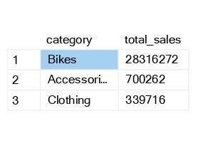

# 📊 SQL Data Analytics Portfolio Project
A SQL-based end-to-end data analytics project transforming raw sales data into actionable business insights.
## 🚀 Overview
This project demonstrates an **end-to-end data analytics pipeline using SQL Server**, transforming raw sales data into meaningful business insights.

It covers data ingestion, exploration, KPI calculation, trend analysis, segmentation, and reporting using advanced SQL techniques.

---
## 🖼️ Project Preview



## 🎯 Objectives

- Build a structured analytics database in SQL Server  
- Load customer, product, and sales data from CSV files  
- Perform exploratory data analysis (EDA)  
- Calculate key business metrics (KPIs)  
- Analyze trends and patterns over time  
- Segment customers and products  
- Create reusable reporting views  

---

## 🏗️ Database Architecture

The project uses a **Star Schema** with a `gold` layer:

- **Fact Table**
  - `gold.fact_sales` → transactional sales data  

- **Dimension Tables**
  - `gold.dim_customers` → customer details  
  - `gold.dim_products` → product details  

---

## ⚙️ Tech Stack

- SQL Server  
- T-SQL  
- Window Functions  
- CTEs  
- Views  
- BULK INSERT  
- CSV Data  

---

## 🔥 Key Features

- 📥 Data loading using `BULK INSERT`  
- 🔍 Schema exploration using `INFORMATION_SCHEMA`  
- 📊 KPI calculations (sales, orders, customers, products)  
- 📈 Time-based trend analysis (monthly/yearly)  
- 🔄 Window functions (`LAG()`, `AVG() OVER()`)  
- 🧠 Customer & product segmentation  
- 📉 Cumulative and moving average analysis  
- 📊 Reporting views for business insights  

---

## 📊 Types of Analysis

### 1. 📂 Data Exploration
- Tables & columns analysis  
- Unique values (countries, categories, products)  

### 2. 📅 Time Analysis
- First & last order dates  
- Monthly & yearly trends  

### 3. 📈 KPI Analysis
- Total sales  
- Total quantity  
- Average price  
- Total orders, customers, products  

### 4. 📊 Performance Analysis
- Year-over-year growth  
- Product performance comparison  

### 5. 🧠 Segmentation
- Customer segmentation: VIP, Regular, New  
- Product segmentation based on revenue  

### 6. 🔄 Cumulative Analysis
- Running total sales  
- Moving average price  

### 7. 📊 Contribution Analysis
- Category contribution to total sales  

---

## 📑 Reporting Views

### 🧍‍♂️ Customer Report (`gold.report_customers`)
Includes:
- Customer details & segmentation  
- Total orders, sales, quantity  
- Recency & lifespan  
- Average order value & monthly spend  

### 📦 Product Report (`gold.report_products`)
Includes:
- Product category & cost  
- Sales performance metrics  
- Customer reach  
- Revenue insights  

---

## 📌 Business Questions Answered

- What are total business sales?  
- Which products generate the most revenue?  
- Who are the top customers?  
- How do sales change over time?  
- Which customers are VIPs?  
- Which categories drive the business?  

---

## 🔄 Project Workflow

1. Create database and schema  
2. Create dimension and fact tables  
3. Load CSV data using `BULK INSERT`  
4. Perform data exploration  
5. Run analytical queries  
6. Build reporting views  

---

## ⚠️ Setup Instructions

### 1. Clone the repository
```bash
git clone https://github.com/vaddeudaykumar200/sql-data-analytics-project.git
```
### 2. Open SQL Server Management Studio
### 3. Update file paths
 ```bash
 'C:\your_path\datasets\gold.dim_customers.csv'
 ```
### 4. Run scripts in order
- Database creation
- Table creation
- Data loading
- Analytics queries
- Reporting views
  
### 🧠 Learning Outcomes
- Built a complete SQL-based analytics pipeline
- Performed EDA using SQL
- Applied window functions for analysis
- Designed Star Schema for analytics
- Created business-ready reporting views
### 🚀 Future Improvements
- Add stored procedures for automation
- Add data quality validation layer
- Build Power BI dashboard
- Optimize queries using indexing
- Add ER diagram
